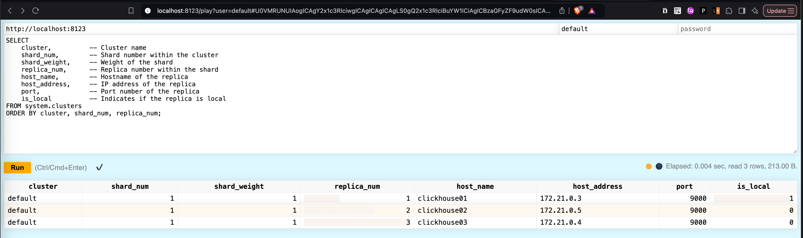
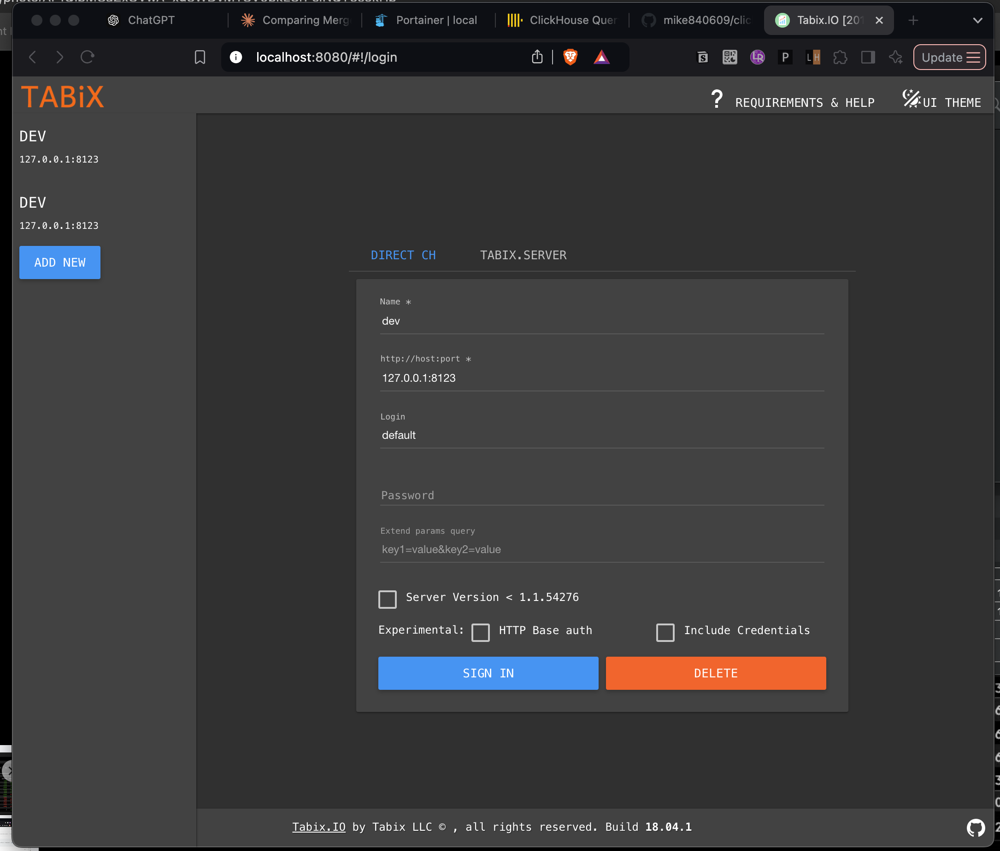
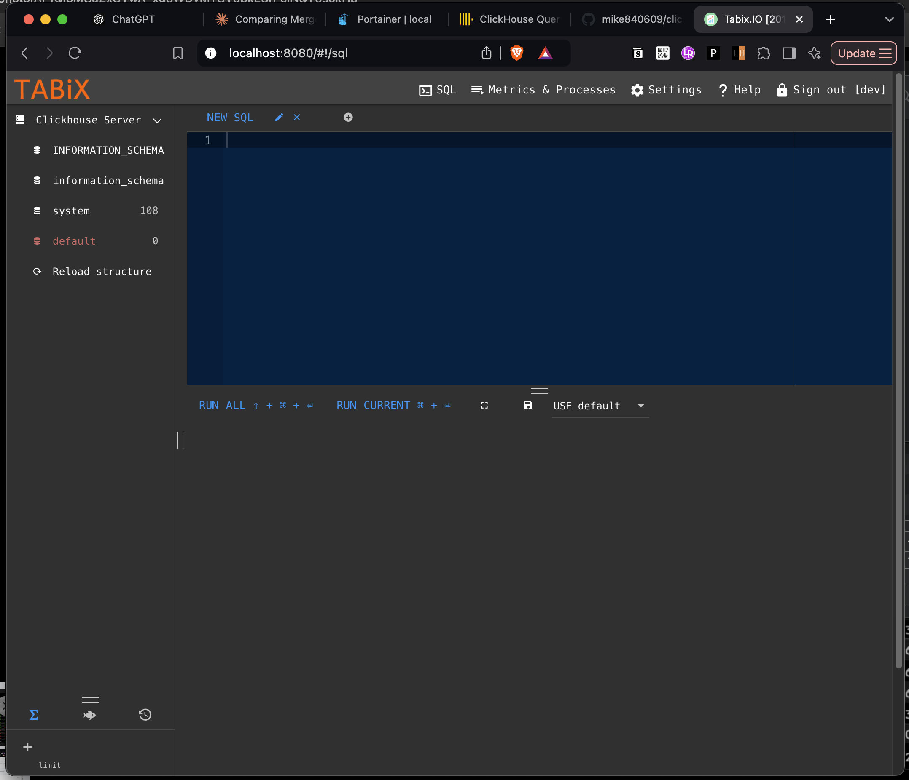

## Clickhouse Cluster
ClickHouse Cluster Setup with 1 Shard and 3 Nodes

### docker command

``` bash
# start service
$ docker compose up -d

# shut down servce 
$ docker compose down 


# curl below url to check
curl http://localhost:8123/ping
# return "Ok."

```


### basic info
web based playground: [http://localhost:8123/play](http://localhost:8123/play) 
account: default
pwd: (empty)


## clikchouse native GUI



## TABIX GUI
web based playground: [http://localhost:8080/play](http://localhost:8080) 
```
Name: dev
Host: 127.0.0.1:8123
Login: default
Password: (empty)
```



